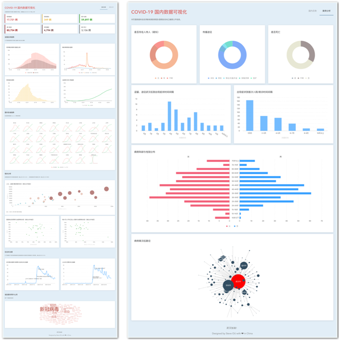

# 2019-covid-19

2019-covid 国内数据综合可视化面板. 



这是一个面向社会公众的数据可视化作品，希望公众可以通过本作品可以更清晰地观察、分析目前疫情相关的海量公开数据。本作品对官方公告、媒体以及互联网企业公开数据等渠道所公布的疫情态势、舆情、病例信息等数据进行收集。在对数据进行汇总、处理后，通过可视化图表的形式对数据进行展示。本作品分为两部分：国内态势分析和病例数据分析。国内态势分析部分，本作品展示了全国以及各省的疫情趋势、指标的相关分析以及社会的关注情况。病例分析部分我们主要展示了病例的主要特点、病例离汉后去向等信息。

## 作品详细介绍

1. 本作品入选可视化公益行动候选名单，可通过本页面进入作品介绍

  [投票 | 疫情数据可视化公益行动第三期优秀作品候选名单公示](https://mp.weixin.qq.com/s/vuPYrPU8K-OEWAFBGVWaFw) (三：COVID-19 国内数据综合可视化)

2. 或者使用 "机器之心 Synced" 小程序查看：

  

## Github Pages

链接：https://ousheobin.github.io/covid-19-vis/#/

## 数据源
特别鸣谢以下数据源为本项目提供数据

- [国家统计局](http://data.stats.gov.cn/)
- [国家卫生健康委](http://www.nhc.gov.cn/)
- [BlankerL/DXY-COVID-19-Data](https://github.com/BlankerL/DXY-COVID-19-Data)
- [澎湃新闻美数课 - 疫情数据汇总](https://github.com/839-Studio/Novel-Coronavirus-Updates)
- [澎湃新闻美数课 - 病例数据汇总](https://github.com/839-Studio/Noval-Coronavirus-763-Cases)
- [百度指数](http://index.baidu.com/)
- [微博指数](https://data.weibo.com/index)

## 使用的技术
- Vue.js
- Element UI
- Antv G2
- Echarts (仅用于图的显示)

*本项目部分第三方库使用 bootcdn / unpkg 加速*

## 如何在本地运行
``` shell
$ pip install -r requirement.txt
$ bash ./buildData.sh
$ npm install
$ npm run dev
```

*本项目使用 Github Action 持续构建，并托管于 Github Action*
